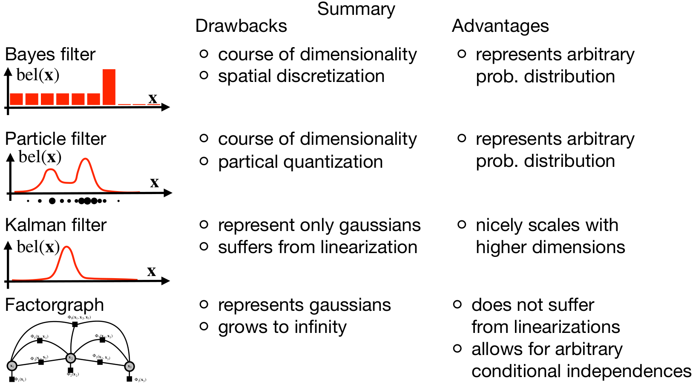

# Comparison of methods Advantages and Disadvantages

In this section we will compare all four localization methods, Bayes filter, particle fitler, Kalman filter and factorgraph.

    

## Unimodal vs Multimodal hypothesis

The particle filter and Bayes filter allow us to maintain multiple high-probability hypotheses about the current state of a robot. Consider the example of the kidnapped robot problem, where our door sensor detects doors at three different locations. Both the particle filter and the Bayes filter can represent this information as three distinct, highly probable hypotheses regarding the current state of the robot. In contrast, such measurements are impossible to represent with a Gaussian distribution, which means that a multimodal hypothesis cannot be represented with a Kalman filter. The factograph approach also allows us to represent various multimodal hypotheses. However, optimizing factographs may not be feasible, or could even be impossible, with arbitrary probability distributions.

## Linear vs non-linear models

The Kalman filter alone struggles with non-linear robot models and measurements. The Extended Kalman Filter addresses this issue by linearizing around the current state's operational point. However, this approximation is sensitive and may not be suitable for highly non-linear models. In contrast, the Bayes filter, factograph and the particle filter are capable of handling non-linear models as effectively as linear ones.

## Representation of state space

Recall that the Bayes filter discretizes the state space into a finite number of bins. This means that even our most precise estimate of the robot's state is subject to errors introduced by the discretization of the state space. For instance, in a discretized 1D space spanning 100 meters, the position could be inaccurately reported with an error of up to 0.5 meters in the worst case. In contrast, other approaches, such as the Kalman filter, Extended Kalman filter, particle filter, and factor graphs, represent the state space continuously.

## EKF and Kalman filter

The Kalman filter provides optimal estimates for unimodal linear systems affected by Gaussian noise. A significant advantage of this method is its efficiency: each dimension of the state space requires only two variables for representation—the mean and variance of the normal distribution. However, a limitation of the Kalman filter is that it can only represent Gaussian probability distributions.

To address the non-linearity of system models and measurement models, the Kalman filter employs linearization. However, as previously noted, this approach is sensitive and may not perform well with highly non-linear models. In such cases, the linearization may lead to inaccurate estimations, limiting the filter's effectiveness in complex scenarios. Another disatvantage is that it can only represent one hypothesis about current robot state, therefore this approach
is not usable for the kindapped robot problem.

## Discrete Bayes filter

The discrete bayes filter can represent multiple hypothesis about current robot state. It can also handle non-linearity of system models and measurement models. Additionally, it can handle arbitrary probability distributions. However, the main drawback of the discrete Bayes filter is the curse of dimensionality. As the number of dimensions in the state space increases, the computational resources and memory required to maintain and update the discrete representation grow exponentially. Additionally, the discrete representation of the state space itself can lead to inaccuracies,

## Particle filter

The particle filter enhances the discrete Bayes filter by using particles to represent state space hypotheses about the robot's current state. It effectively manages non-linear system and measurement models and can represent arbitrary probability distributions. Unlike the discrete Bayes filter, it better avoids the curse of dimensionality by using a fixed number of particles.

However, the particle filter's accuracy depends on sufficiently populating the initial particle distribution around the robot's actual state. Thus, despite not expanding with the dimensionality, the total number of particles required for accurate localization can still be relatively high.

