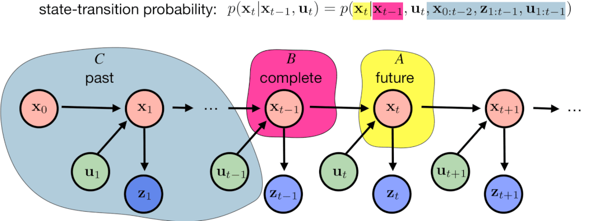
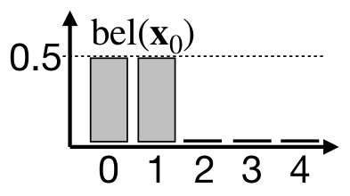
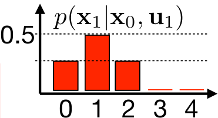
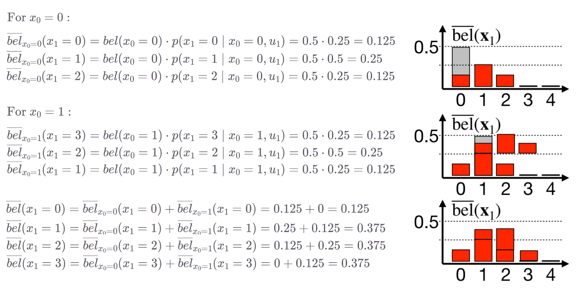
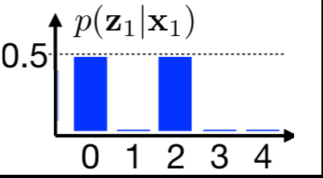
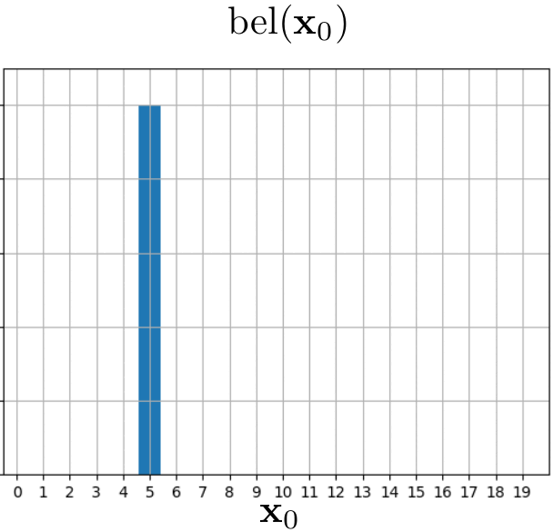
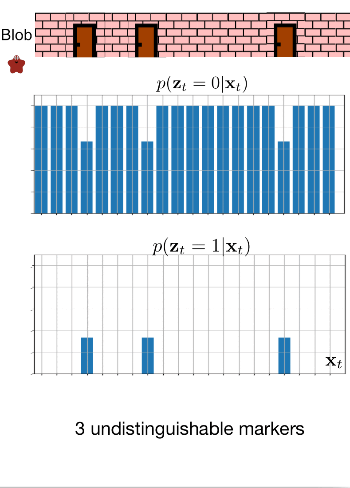
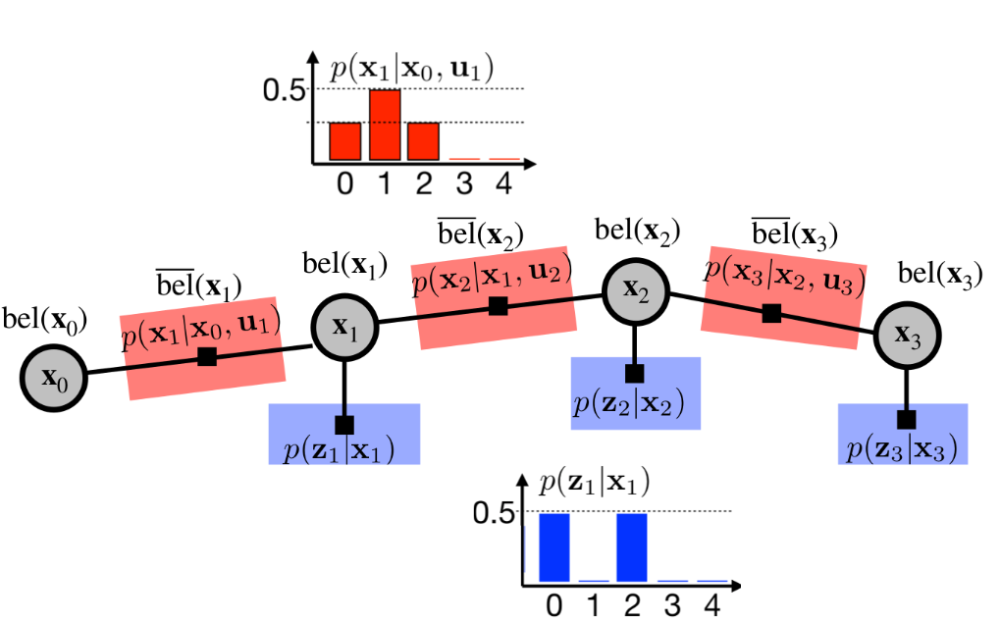

# Discrete Bayes Filter

## Complete States

A complete state refers to a state that contains all the necessary information, so that the next state can be determined
solely based on the current state. In other words, if a state is complete, the transition probability to the next state
can be expressed as a conditional probability function, denoted as $p(x_t \mid x_{t-1}, u_t)$, where $x_t$ represents the
next state, $x_{t-1}$ represents the current state, and $u_t$ represents the control input or action taken to transition
from the current state to the next state. The state $x_{t-1}$ is complete, whene future state $x_{t}$ is conditionally 
independent on past states $x_{0:t-2}$. 

### Are our states complete ? Markov assumption

When discussing robot localization, we typically model the robot's state using key parameters like its position, speed, and acceleration. 
However, this representation is an approximation that simplifies the real complexity of the robot. Our model of robot state is only and approximation of the real robot state.

Despite these simplifications, we strive for our model of the robot's state to be complete to facilitate effective localization methods.
In practice, our modeled states often do not encompass every possible influencing factor, leading us to make a pragmatic assumption that they do. This assumption is referred to as the Markov assumption.

The Markov Property, central to this assumption, implies that the system is memoryless—meaning the future state of the robot depends solely on the current state and not on the sequence of events or states that preceded it. This property simplifies the mathematical modeling and computational tasks involved in robot localization by reducing the amount of historical data that must be considered at each step.

### Simplifications from Markov assumption

The state-transition probability $p(x_t \mid x_{t-1}, u_t)$ is typically complex, potentially involving all previous states $x_{0:t-2}$​, all previous measurements 
$z_{1:t-1}$​, and all previous actions $u_{1:t}$. The assumption tells us that future depends only on the current state
therefore the

$$ p(x_t \mid x_{t-1}, u_t) = p(x_t \mid x_{t-1}, u_t, x_{0:t-2}, z_{1:t-1}, u_{1:t}). $$

Simmilarly we can simplify the measurement probability as

$$ p(z_t \mid x_{t}) = p(z_t \mid x_{t}, x_{0:t-1}, z_{1:t-1}, u_{1:t}). $$

    

## Discreete Bayes Filter Alghorithm

The Discrete Bayes Filter is an algorithm used in robotics to estimate the state of a system based on discrete observations and a model of the system dynamics.
This alghorithm enables us to incorporate noisy sesnor measurements and work with not precise models to predict probabilistic state of a system over time. 
The algorithm operates in a cyclical process involving two main steps: prediction and update. These steps are recursively repeated after initialization.
We will demonstrate this alghorithm in the following example.

### 1. Initialization

The Discreete Bayes filter discretizes the state space. In this example, the robot state is denoted just as position in one dimensional enviroment. The alghorithm
starts with initialization of our belief of the robot state $x_0$. In this case, we believe that the robot is at first two positions with probability $p(x_0 = 0) = p(x_0 = 1) = 0.5$.

    

### 2. Prediction step

Now lets define the robot movement. The robot can move along the one dimensional space in positive direction. The robot's intention is to move to the next position each time it moves.
The robot's movement is uncertain, it can also move by 2 positions or stay where he is. We can model this by state-transitional probability $p(x_t \mid x_{t-1}, u_{t})$, where
$p(x_{t} = x_{t-1} \mid x_{t-1}, u_{t}) = 0.25$, $ p(x_{t} = x_{t-1} + 1 \mid x_{t-1}, u_{t}) = 0.5 $ and $ p(x_{t} = x_{t-1} + 2 \mid x_{t-1}, u_{t}) = 0.25. $

    

To predict the prior belief $\overline{bel}(x_1)$ after an action $u_1$​ has been taken, we use the concept of convolution. Convolution, in this context, is used to combine two sets of information: the initial belief $bel(x_0)$ and the motion modelrepresented by the state transition probabilities $p(x_t \mid x_{t-1}, u_{t})$. The operation yields a new prior belief $\overline{bel}(x_1)$ that incorporates the robot's movement in our estimation. The convolution can be described mathematically as follows:

$$ \overline{bel}(x_t) = \sum_{x_{t-1}} p( x_t \mid x_{t-1}, u_t) \cdot bel(x_{t-1}) $$

    
    Example of prediction step computation.

### 3. Update step

The update step incorporates measurement into our belief estimation. Imagine we have two robot detectors at position $0$ and position $2$. We can represent the measurement probability as
$p(z_t = 0 \mid x_1) = p(z_t = 2 \mid x_1) = 0.5$. We can compute posterior $bel(x_t)$ by simply multiplying prior $\overline{bel}(x_t)$ with measurement probability $p(z_t \mid x_t)$. The posterior
belief $bel(x_t)$ must be additionally normalized by $\eta$ in order to represent probability distribution. We can write this mathematically as

$$ bel(x_t) = \eta \cdot p(z_t \mid x_t) \cdot \overline{bel}(x_t). $$ 

    

Let us remind that the prior $\overline{bel}(x_t)$ is computed by incorporation state-transitional probability $p(x_t \mid x_{t-1}, u_{t})$ and the posterior belief $bel(x_t)$ is computed by incorporating
measurement probability $p(x_t \mid x_{t-1}, u_{t})$.

$$\overline{bel}(x_t) = p(x_t \mid z_{1:t-1}, u_{1:t}) \dots  \text{ prior belief}$$

$$bel(x_t) = p(x_t \mid z_{1:t}, u_{1:t}) \dots \text{ posterior belief}$$

## Example 1: Just the prediction

In this example, we will track the position of our little friend, the red blob. The red blob begins its movement at position $5$. It declares that it will move one position to the right in each iteration. However, due to the inherent uncertainties in its reporting (after all, it is only a blob), we approach this movement information with caution. We represent it using the state-transitional probability $p(x_t \mid x_{t-1}, u_{t})$. The evolution of our belief over time can be observed in the following animation.

    

## Example 2: Blob can detect the doors !

In this scenario, the blob has informed us that it can detect when it is standing in front of a door. It has promised to notify us each time it smells the doors. Unfortunately, the poor little blob has caught the flu, which has compromised its sense of smell. Consequently, we cannot completely rely on its detection ability.

We can model this situation using the measurement probability $p(z_t \mid x_t)$. We know that in the room where the blob is currently located, the doors are at position 7. The blob continues to move only to the right. The measurement probability is showcased on the following two images.

We believe that blob is currently at the position $3$, but is it really the case ? Let's observe blob localization in the following animation.

    

## Example 3: Where is blob ?

In this scenario, we have no idea where the blob is. We however, know that he is in already known enviroment with 3 doors. Blob again promised us he will move only to the right.
This scenario corresponds to the Kidnapped robot problem, where our goal is to localize a robot in already known enviroment with no prior information about robot state.

    

## Recapitulation

The Discrete Bayes Filter discretizes the state space, assigning a probability to each state. These probabilities are represented by our belief $bel(xt)$. The algorithm incorporates state-transition probabilities $p(x_t \mid x_{t-1}, u_{t})$ and measurement probabilities $p(z_t \mid x_t)$ in a recurrent fashion, in order to estimate the belief about the robot's state. To simplify this estimation, the Markov assumption of a complete state is used. This enables us to represent belief estimation as follows.

    

One advantage of the Discrete Bayes Filter is that it can represent arbitrary probability distributions. In contrast, the Kalman Filter and the Extended Kalman Filter represent beliefs using linear Gaussian models. The Bayes Filter also enables us to solve the kidnapped robot problem, as it is multimodal. It can represent multiple high-probability hypotheses, for example, two possible positions in the environment. This cannot be done with a Kalman Filter. However, the Discrete Bayes Filter suffers from the curse of dimensionality. Imagine a scenario where we want to estimate a robot's position in a 100x100 meter square. We could approximate this with 10,000 bins. Now, let's add velocity estimation to each state, where the robot can move from -1 to +1 meter per second. We will discretize this into 20 values, spaced 0.1 meter per second. Now, the state space is 200,000 bins large. As you can see, the amount of memory needed explodes exponentially.

## Additional materials

This [jupyter notebook](https://github.com/rlabbe/Kalman-and-Bayesian-Filters-in-Python/blob/master/02-Discrete-Bayes.ipynb) explains Discrete Bayes Filter with code python code snippets, which may help you understand the topic better. Lastly, if you are interested in more theory behind Discrete Bayes Filter, you can check out the [Probabilistic Robotics](https://docs.ufpr.br/~danielsantos/ProbabilisticRobotics.pdf) book.
