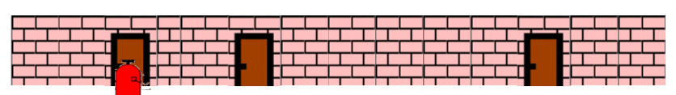
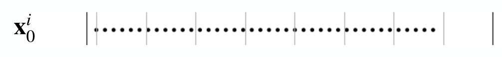
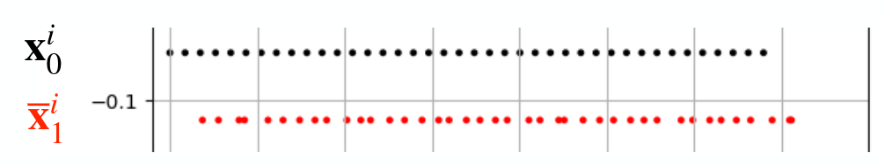
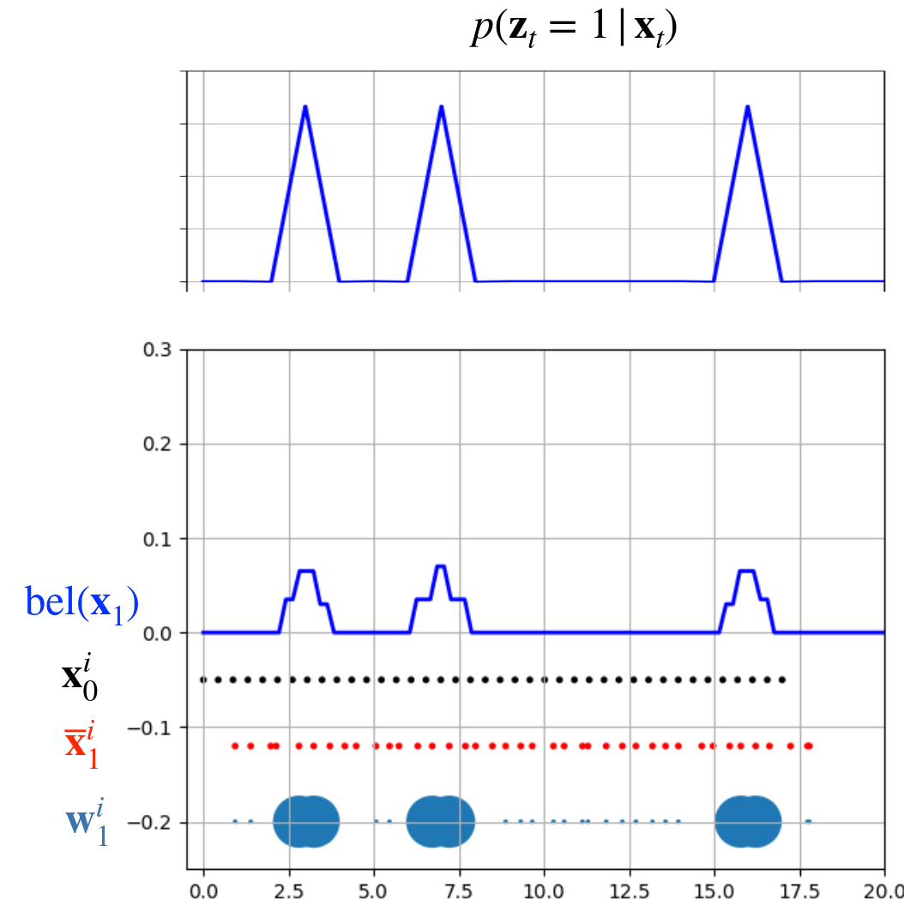
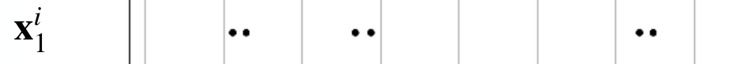
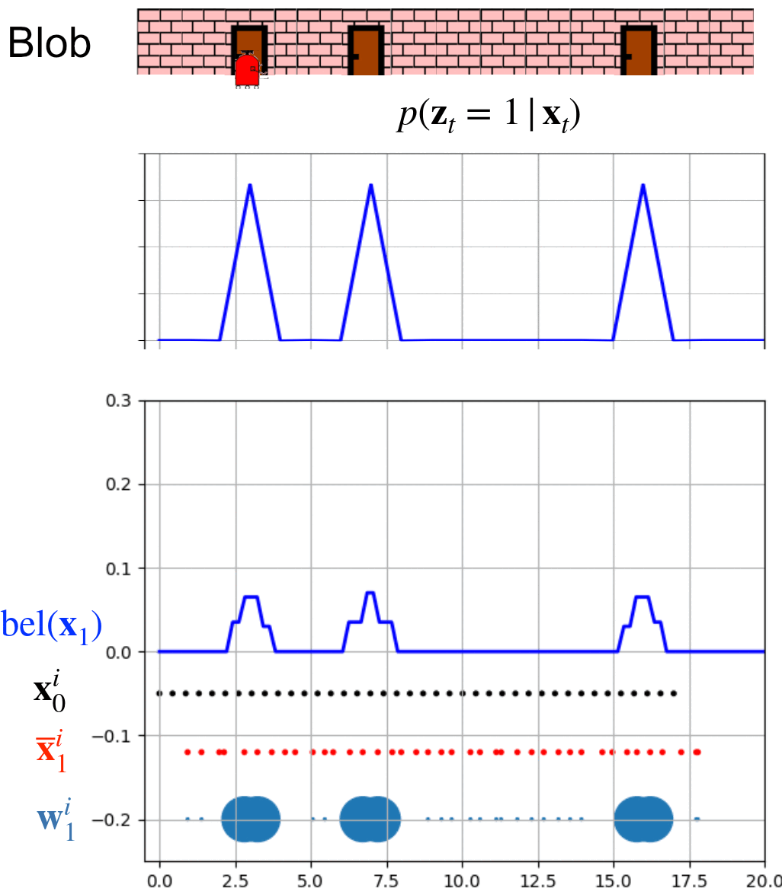
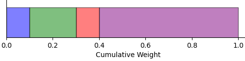
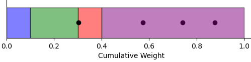
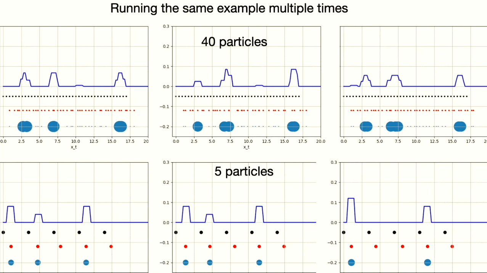

# Particle Filter

Particle filters are used in robotics for estimating the probability distribution of a robot's state $p(x)$, especially 
useful in scenarios where processes are non-linear or involve non-Gaussian noise. Particle filter represents the unknown 
probability distribution $p(x)$ using a set of particles, and updates these particles through prediction and correction 
steps based on new data.

The transition probability $p(x_t \mid x_{t−1},u_{t−1})$ describes the likelihood of the robot transitioning from one 
state $x_{t−1}$​ to another $x_t$​ given a particular action $u_{t−1}$​. This could be modeled using odometry data, 
which might, for example, be assumed Gaussian with a known standard deviation, reflecting the inherent uncertainty in 
the robot's movement.

The measurement probability $p(z \mid x_t)$ quantifies how likely it is to observe a particular measurement $z$, such 
as the distance from a known marker, given the robot's current state $x_t$​. The accuracy of this measurement is also 
modeled by a probability distribution, accounting for possible errors in sensor data.

## How does the algorithm work

Let's explore how this algorithm works with a practical example. Imagine a red blob in a simple 1D world where it can 
only move along the x-axis in a positive direction. The blob is somewhere in the environment shown below, but it 
doesn't know its exact location. However, it can estimate its movement from one position to another through the 
transitional probability $p(x_t \mid x_{t−1},u_{t−1})$ and, it has the ability to detect when a door is 
directly in front of it, using $p(z \mid x_t)$. Let's help the blob localize itself in this known environment!

    
    Blob in the enviroment.

### 1. Initialize particles

Since the blob has no idea where it is, and neither do we, the algorithm starts by initializing particles to represent 
potential positions. Given no prior information about the blob’s initial state $p(x_0)$, we will distribute $N$ 
particles $\mathcal{L} = \\{ x_0^1, \dots, x_0^N \\}$ uniformly across the entire room to positions $x_0^i$, assigning 
each particle an equal weight of $\frac{1}{N}$​ (i for each particle). This approach reflects our complete uncertainty 
about the blob’s location. Utilizing a higher number of particles can provide a more precise estimation of $p(x)$, 
but this comes at the cost of increased computational and memory demands.

    
    Our initial hypothesis of the blob state, uniformly distributed over the whole enviroment.

### 2. Prediction step: Blob Moved !

The blob reported moving approximately $u_{t-1} = 0.3$ meters to the right. However, given the inherent uncertainties 
in its reporting (since it's only a blob), we treat this movement information cautiously. Therefore, the transitional 
probability $p(x_t \mid x_{t−1},u_{t−1})$ is modeled using a Gaussian distribution, reflecting the potential 
inaccuracies in the blob's movement measurement. We can express this as

$$p(x_t^i \mid x_{t−1}^i,u_{t−1}^i) = \mathcal{N}(x_{t-1}^i + u_{t-1}, \sigma^2).$$

We then adjust each particle's position by sampling from $\mathcal{N}(x_{t-1}^i + u_{t-1}, \sigma^2)$, updating their 
estimated positions based on the blob's reported movement.

    
    Prediction of the blob movement in red.

### 3. Measurement update: Blob smells the doors !

Blob can tell us if he smells the doors or not. This gives us information about the current state of the blob, since the 
enviroment is known. In this step, we adjust the weights $w_t^i$ of the particles based on the measurement probability 
$w_t^i = p(z_t \mid x_t^i)$. This probability reflects how likely each particle's estimated position aligns with the 
blob's sensory input.

In our scenario, if the blob smells the doors, the weights for particles that are close to the known door positions are 
increased, reflecting a higher likelihood that these particles represent the blob's actual position. If the 
blob does not smell the doors, we increase the weights of particles that are farther from the doors. This proportional 
adjustment ensures that each particle's weight corresponds to the plausibility of the sensory data given the particle's 
estimated location.

Additionally, the weights of all particles are normalized so that they sum up to 1, ensuring that the weights represent 
a valid probability distribution over the particle set.

$$ w^i_{\text{norm}} = \frac{w^i}{\sum_{i=1}^N w^j}$$

    
    Blob detected doors at this moment, evident from the probability $p(z_t = 1 \mid x_t)$. Particles are adjusted 
    based on this detection, with their weights reflecting the likelihood of each particle's state. Our belief about 
    the system’s state $bel(x)$, is then updated by integrating the weights and positions of these particles. The 
    process of $bel(x)$ reconstruction will be explained later.

### 4. Particle resampling.

As the particle filter gains more information, maintaining a uniform distribution of particles across the entire map 
becomes inefficient. To optimize our estimation of $p(x)$, the resampling process comes into play. This process 
systematically eliminates particles with very low weights, which represent less likely positions, and duplicates 
particles with very high weights. This adjustment not only focuses the 
computational effort on more probable states but also ensures that the density of particles is greater in areas of 
higher likelihood. We will deal with detailed explanation of resampling process later.

    
    Particles are resampled around positions with the highest probability. Do not be fooled by the image, the number of 
    particles is still $N$, some of them just share the same robot state.

### 5. Go back to step 2

The particle filter algorithm cycles through prediction, measurement, and resampling steps over time. Now, let's watch 
the following animation to see how Blob localizes itself in the environment.

    
    This animation shows 8 whole iterations of particle filter. (Should i explain the process more ?)

## Why does it work ?

As previously mentioned, each particle in the filter represents a hypothesis about the robot's state within the 
probability distribution $p(x)$. Our belief about the robot's state, denoted as $bel(x)$, can be reconstructed by 
integrating over the particles. Regions where particles are more densely aggregated correspond to 
higher probability areas in our belief of the robot's state.

Another perspective on probability density is to view each particle's weight as an estimate of probability. The greater the 
weight of a particle, the greater the confidence in that particle's state hypothesis, and hence, the higher the 
probability that the robot is in that state according to our belief. As we assigned weights to our particles we will 
use the density approach.

We have a set of weighted samples, particles given as:

$$\mathcal{L} = \bigl\{ \langle x^i, w^i \rangle\bigl\}_{i = 1, \dots, N}$$

These samples represent the posterior probability approximation

$$bel(x) = \sum_{i=1}^N w^i \cdot \delta_{x^i},$$

where $\delta_{x^i}$ represents dirac impulse at position/state $x^i$.

Our baseline particles are sampled from our belief $bel(x)$. But in order to estimate $p(x)$ we need to generate 
samples from it and that is imposible. This is where the importance sampling principle comes into play. By weighting 
the samples from $bel(x)$ with weights proportional to the ratio of $p(x)$ to $bel(x)$, we can effectively estimate 
the true probability distribution $p(x)$.

$$w = \frac{p(x)}{bel(x)}$$

But how do we know that weights are proportional to the ratio between $p(x)$ and $bel(x)$? The answer lies in our 
measurement model. This model assigns higher weights to the particles, or hypotheses, that align with our knowledge of 
the enviroment. Essentially, while we generate possible robot positions from an arbitrary probability distribution, 
our measurement model (for example marker detections), assigns higher weights to particles that more closely correspond 
to the unknown true distribution $p(x)$.

## Resampling

Resampling is a process that takes the current states and weights of particles as inputs and outputs a new, resampled 
set of particles. The goal of resampling is to concentrate particles around the most probable states of the robot at 
the current iteration.

### Multinomial Resampling

The idea behind this resampling method involves computing a cumulative sum of the normalized weights. This sum results 
in an array of values ranging from 0 to 1, with each subsequent value being greater than or equal to the previous.

To resample, a random number is generated within the range of 0 to 1. The new particle is then selected based on the 
interval into which this random number falls. Each interval corresponds to a particle, and the size of the interval is 
proportional to the particle's normalized weight. Larger intervals correspond to particles with higher weights, thus 
increasing their likelihood of selection.

Let’s visualize the resampling process with an example. Suppose we have four particles with weights 
$\\{0.1, 0.2, 0.1, 0.6\\}$ and positions $\\{1.0, 1.5, 2.0, 2.3\\}$. First, we compute the cumulative sum of the 
normalized weights, resulting in an array of cumulative values.

We can visually represent these cumulative weights as sections of a line segment ranging from 0 to 1. The cumulative sum 
for our weights would split the segment into intervals: $\[0, 0.1\]$, $\(0.1, 0.3\]$, $\(0.3, 0.4\]$, and $\(0.4, 1.0\]$. 
Each interval represents certain particle.

    

Next, we generate four random numbers within the range of 0 to 1: $\\{0.74, 0.574, 0.877, 0.303\\}$. Each number 
determines the selection of a new particle based on the interval it falls into:

- 0.74, 0.574, and 0.877 fall into the interval $\(0.4, 1.0\]$, corresponding to the position 2.3.
- 0.303 falls into the interval $\(0.3, 0.4\]$, corresponding to the position 2.0.

    

In the end, we end up with new particles at positions $\\{2.3, 2.3, 2.3, 2.0\\}$ with weights equal to 
$w^i = \frac{1}{N} = 0.25$. These new particles indicate a higher likelihood of the robot being at position 2.3, as 
reflected by the frequency of selection based on the random numbers generated.

### Stochastic universal resampling

The Stochastic universal resampling starts similarly to multinomial resampling by computing cumulative sum of the normalized weights.
After that, the interval from $\[0, 1\]$ is split into $N$ equal segments and a random number $s$ is generated in range $\[0, \frac{1}{N}\]$.
After that, $N$ numbers $t_i = s + i \cdot \frac{1}{N}$ are generated for $i \in [0,\dots,N-1]$. For each $i$, new particle will be resampled based on
the current index. The index starts at $1$ and it is increment by $1$ whenever $t_i > c_{\text{index}}$, where $c$ denotes the cumulative
sum array. The index is incremented till $t_i < c_{\text{index}}$. We will again visualize this resampling alghorithm by an example. 

We have four particles with weights $\\{0.1, 0.2, 0.1, 0.6\\}$ and positions $\\{1.0, 1.5, 2.0, 2.3\\}$. The cumulative sum is 
$c = \\{0.1,0.3,0.4,1.0\\}$. We generate random number $s = 0.02$ from interval $\[0, \frac{1}{N}\] = \[0, \frac{1}{4}\]$, leading to points 
$t_i = \\{0.02,0.27,0.52,0.77\\}$. Number $t_1 = 0.02$ is lower than $c_1 = 0.1$ therefore the index stays at $1$. The first generated particle 
is on position $x = 1.0$, corresponding to the first weight and first value $c_1$ in the cumulative sum. Number $t_2 = 0.27$ is again higher 
$c_1 = 0.1$, and lower than $c_3 = 0.4$, therefore the index is increased to $2$. The second generated particle is on position $x = 1.5$, corresponding 
to the second weight. The $t_3 = 0.52 > c_2 = 0.3$ and also $t_3 = 0.52 > c_3 = 0.4$,therefore the index is increased to $4$. 
The third and fourth particle is generated at position $x = 2.3$, corresponding to the fourth weight.  Simillarly, to multinomial resampling
all new particles share the same weight $w = 0.25 = \frac{1}{N}$.

(I think this part should be somehow rewritten, the explanation is somewhat janky.)

### Comparison

Multinomial resampling tends to exhibit higher variance among resampled particles and operates with a time complexity of $\mathcal{O}(N \cdot \log N)$. 
In contrast, Stochastic Universal Resampling (SUR) is a preferable alternative due to its linear time complexity of $\mathcal{O}(N)$ and reduced 
variance in the resampled particles. This makes SUR both faster and more statistically efficient.

## Where does it break ? 

The particle filter algorithm relies on generating some particles close to the actual state of the robot. If no particles are generated near the true robot state, the algorithm may converge to an incorrect estimation of the robot's state $p(x)$. Resampling makes this issue even worse, by potentially increasing the number of particles near an incorrect hypothesis, especially if measurements mistakenly assign higher weights to these particles. Therefore, it's important to have enough particles near the real location of the robot to keep the algorithm working correctly.

    
    

    This example shows six different instances of particle filter alghorithm. You can observe that one instance with 5 particles converged
    on the wrong robot position.
    

